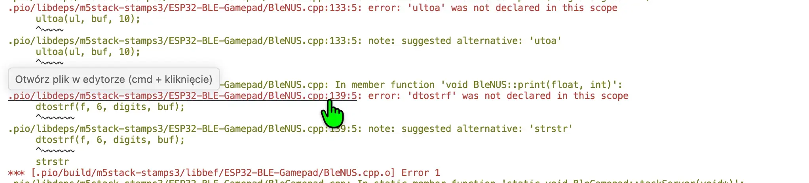
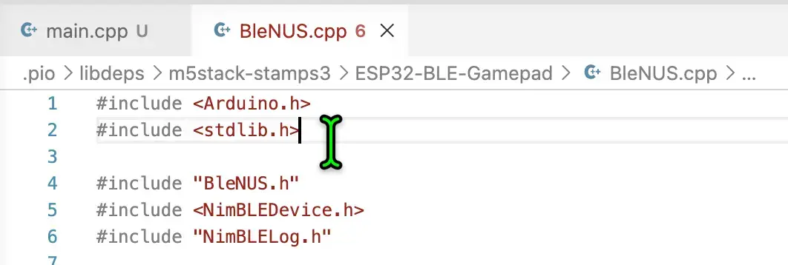

# CardputerWheel - BLE fork
This version has numeric values tweaked for Euro Truck Simulator 2 in the code. It was not tested with other games. Review the 16-bit integer values of axis in the code (-32768 to 32767) if the controller is not working as expected.

## Compiling:
- Open with PlatformIO.
- Build for the first time. It will throw an error.
- Scroll up the build terminal and Ctrl - Click (or Open Apple ⌘ - Click on Mac) on BleNUS.cpp (NOT BleNUS.cpp.o) to open the file.

- Add lines 1 and 2 to the top of the file

- Build again. It should finish successfully.

- **Alternatively, use Launcher and the already-built .bin file in Releases.**

## Connecting to a PC
No pairing mode activation is needed. The device will show up as "ESP32 BLE Gamepad" as soon as it's turned on.

## Recommended Euro Truck Simulator 2 settings
- Steering type: `Steering wheel`
- Steering sensitivity: `1,00`
- Steering non-linearity: `2,00`
- Steering axis: `X axis`
- Steering axis dead zone: `0%`
- Steering axis mode: `Centered`

## Controls:
* `Tilt` - Steering (X-axis)

* `=` or top button - controller button 1
* `1` - controller button 2
* `2` - controller button 3
* `-` - controller button 4
* `OK` - controller button 5
* `E` - controller button 6
* `S` - controller button 7
* `A` - controller button 8
* `D` - controller button 9
* `F` - controller button 10
* `G` - controller button 11
* `H` - controller button 12
* `O` - controller button 13
* `J` - controller button 14
* `K` - controller button 15
* `L` - controller button 16

* `Space` - enable / disable display

* `;` - Increase sensitivity
* `.` - Decrease sensitivity
